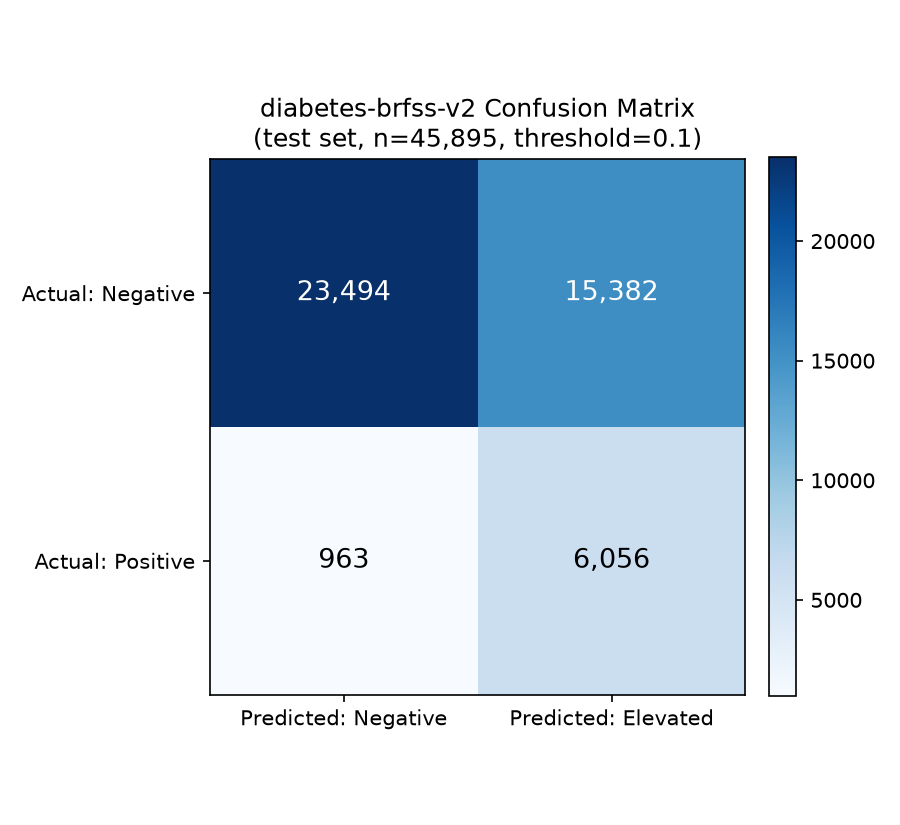
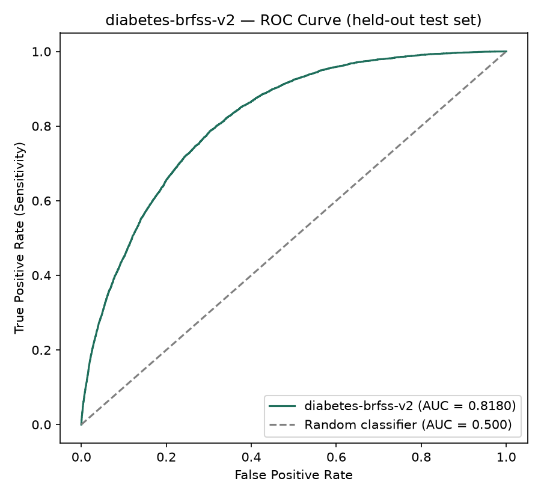
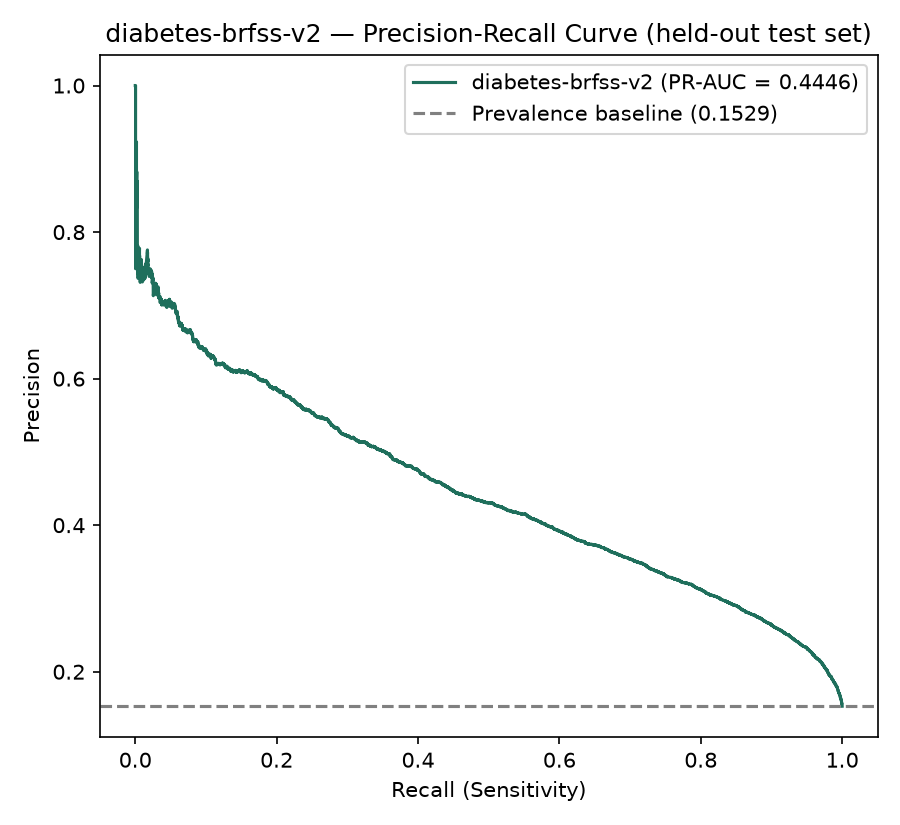
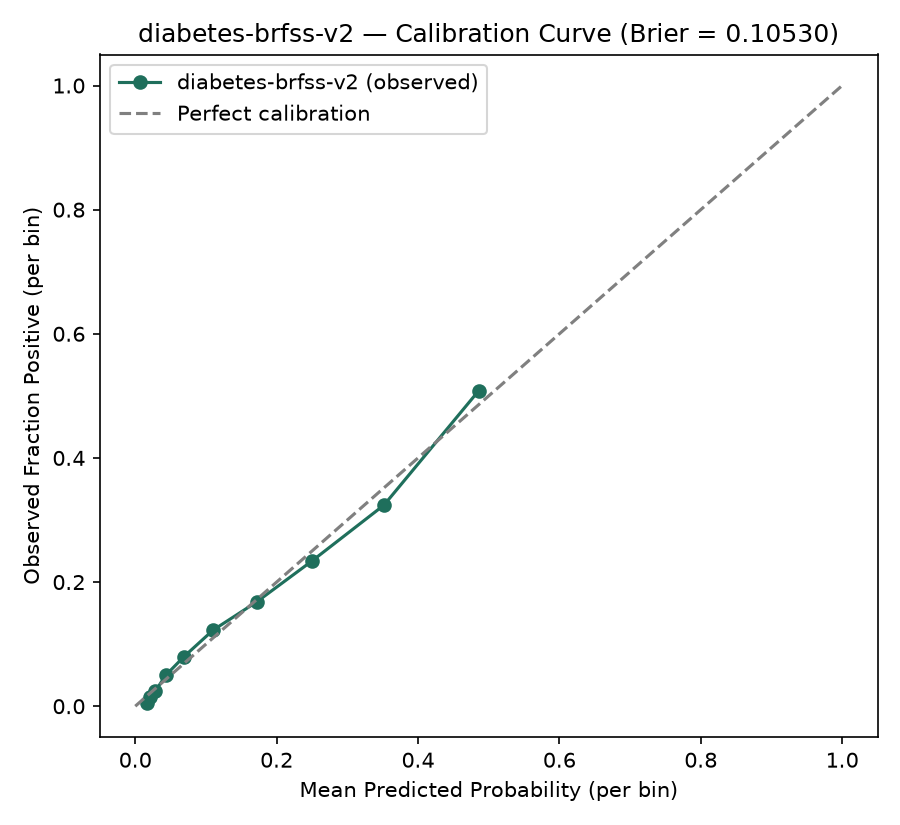
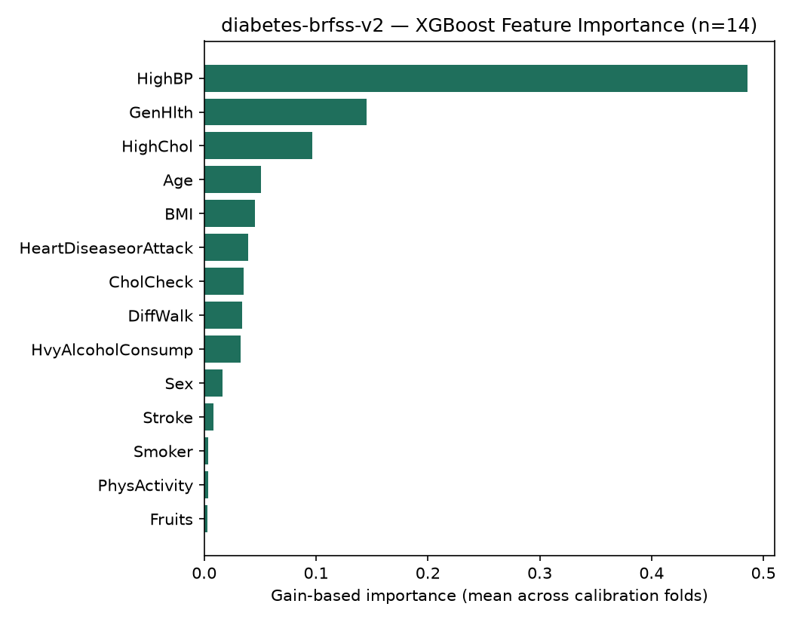

# Evaluation — SwasthAI Diabetes Risk Model

`v2 = diabetes-brfss-v2 (current production)`. `v1 = diabetes-brfss-v1 (rollback / historical baseline)`. Every metric below is labeled by version — do not mix them.

## Evidence and Reproducibility Statement

The metrics in this document come from two consistent sources:

1. **Repository-saved evaluation evidence**: `ml_pipeline/diabetes/artifacts/diabetes_metadata_v2.json` (field `test_metrics`), `ml_pipeline/diabetes/reports/v2_test_evaluation.json`, and `ml_pipeline/diabetes/reports/evaluation.md` (v1's final test metrics).
2. **An independent reproduction performed specifically for this documentation** (`docs/ml/diabetes/independent_reproduction.json`): both artifacts were loaded read-only and run (`predict_proba`) against `ml_pipeline/diabetes/data/processed/brfss_test.csv` — the same 45,895-row held-out test split both versions' metadata references (confirmed: the file has exactly 45,896 lines = 1 header + 45,895 data rows). No retraining occurred.

**Result: the independent reproduction of v2 is a bit-for-bit match with the stored `test_metrics` in `diabetes_metadata_v2.json`** (accuracy, precision, recall, specificity, F1, ROC-AUC, PR-AUC, Brier score, and all four confusion matrix cells identical to the value stored in metadata). The v1 reproduction matches `evaluation.md`'s reported figures to the precision they were reported at. This cross-check found **zero discrepancies**.

## v2 — Feature Contract (14 features)

Verified consistent across `diabetes_metadata_v2.json` (field `feature_order`), `backend/app/models/prediction.py` (`DiabetesPredictionInput`), `backend/app/services/prediction_service.py` (`predict_diabetes_risk`'s feature mapping), `backend/app/ai/models/diabetes_model.py` (`FEATURE_RANGES`), `frontend/prediction-diabetes.html`, and `ml_pipeline/diabetes/inference_test_brfss_v2.py` (asserts exactly 14 features at runtime — re-run during this documentation pass, passed).

| # | API field (snake_case) | Model column (training-time) | Type / range | Meaning |
|--:|---|---|---|---|
| 1 | `sex` | `Sex` | `{0, 1}` | 0 = female, 1 = male |
| 2 | `age` | `Age` | `{1..13}` | 13-band BRFSS age category (1 = 18-24 … 13 = 80+), not raw years |
| 3 | `bmi` | `BMI` | `[10, 100]` float | Body mass index |
| 4 | `high_bp` | `HighBP` | `{0, 1}` | Ever told you have high blood pressure |
| 5 | `high_chol` | `HighChol` | `{0, 1}` | Ever told you have high cholesterol |
| 6 | `chol_check` | `CholCheck` | `{0, 1}` | Cholesterol check within the past 5 years |
| 7 | `heart_disease_or_attack` | `HeartDiseaseorAttack` | `{0, 1}` | Coronary heart disease or myocardial infarction |
| 8 | `phys_activity` | `PhysActivity` | `{0, 1}` | Physical activity in past 30 days (excluding job) |
| 9 | `fruits` | `Fruits` | `{0, 1}` | Consumes fruit ≥1 times per day |
| 10 | `hvy_alcohol_consump` | `HvyAlcoholConsump` | `{0, 1}` | Heavy alcohol consumption |
| 11 | `stroke` | `Stroke` | `{0, 1}` | Ever told you had a stroke |
| 12 | `gen_hlth` | `GenHlth` | `{1..5}` | Self-rated general health: 1=excellent … 5=poor |
| 13 | `diff_walk` | `DiffWalk` | `{0, 1}` | Serious difficulty walking or climbing stairs |
| 14 | `smoker` | `Smoker` | `{0, 1}` | Smoked ≥100 cigarettes lifetime |

All 14 are used by the model (this is the model's complete `feature_order` — nothing in this table is unused, and no additional feature exists that is absent from this table).

## v1 → v2 Feature Change

| Feature (training-time name) | In v1 (21) | In v2 (14) | Status / reason (if removed) |
|---|:--:|:--:|---|
| HighBP | ✓ | ✓ | Retained |
| HighChol | ✓ | ✓ | Retained |
| CholCheck | ✓ | ✓ | Retained |
| BMI | ✓ | ✓ | Retained |
| Smoker | ✓ | ✓ | Retained |
| Stroke | ✓ | ✓ | Retained |
| HeartDiseaseorAttack | ✓ | ✓ | Retained |
| PhysActivity | ✓ | ✓ | Retained |
| Fruits | ✓ | ✓ | Retained |
| HvyAlcoholConsump | ✓ | ✓ | Retained |
| GenHlth | ✓ | ✓ | Retained |
| DiffWalk | ✓ | ✓ | Retained |
| Sex | ✓ | ✓ | Retained |
| Age | ✓ | ✓ | Retained |
| Veggies | ✓ | — | Removed — redundant with retained `Fruits`, near-zero importance (`diabetes_metadata_v2.json` field `feature_reduction_rationale`) |
| AnyHealthcare | ✓ | — | Removed — healthcare-access proxy, not clinically necessary for a screening tool |
| NoDocbcCost | ✓ | — | Removed — cost-barrier/access proxy |
| MentHlth | ✓ | — | Removed — high recall-burden question, low marginal value |
| PhysHlth | ✓ | — | Removed — high recall-burden question, low marginal value |
| Education | ✓ | — | Removed — socioeconomic proxy |
| Income | ✓ | — | Removed — socioeconomic proxy |

No feature was newly introduced in v2 that wasn't already present in v1 — v2 is a strict subset. Source: `diabetes_metadata_v2.json` fields `feature_order` (v2) vs. `metadata.json` field `feature_order` (v1), and `feature_reduction_rationale`.

## v2 — Final Test-Set Performance (current production)

Test set: n = 45,895, threshold = 0.10 (from metadata, not hardcoded).

| Metric | Value |
|---|--:|
| Accuracy | 0.6439 |
| Precision | 0.2825 |
| Recall / Sensitivity | 0.8628 |
| Specificity | 0.6043 |
| F1-score | 0.4256 |
| ROC-AUC | 0.8180 |
| PR-AUC | 0.4446 |
| Brier score | 0.10530 |
| TP | 6,056 |
| TN | 23,494 |
| FP | 15,382 |
| FN | 963 |

Source: `diabetes_metadata_v2.json` field `test_metrics`, cross-verified by independent reproduction (`docs/ml/diabetes/independent_reproduction.json`, key `v2_diabetes_brfss_v2`).

## v2 — Confusion Matrix

|  | Predicted: Negative | Predicted: Elevated |
|---|--:|--:|
| **Actual: Negative** (n=38,876) | TN = 23,494 | FP = 15,382 |
| **Actual: Positive** (n=7,019) | FN = 963 | TP = 6,056 |

Consistency check: precision = TP/(TP+FP) = 6056/21438 = 0.2825 ✓; recall = TP/(TP+FN) = 6056/7019 = 0.8628 ✓; specificity = TN/(TN+FP) = 23494/38876 = 0.6043 ✓ — all agree with the table above.

## v2 — ROC Curve

AUC = 0.8180, generated from the actual predicted probabilities on the held-out test set (not the 10-point threshold sweep — this is the full curve computed from continuous probability output).

## v2 — Precision-Recall Curve

PR-AUC (average precision) = 0.4446. Baseline shown is the test-set prevalence (0.1529) — the precision a model with no discriminative power would achieve at any recall level, appropriate for this imbalanced (~15% positive) classification task.

## v2 — Calibration

- Calibration method: sigmoid (Platt scaling) via `CalibratedClassifierCV`.
- Calibration decision (OOF, training split only): raw Brier 0.18278 → calibrated Brier 0.10626 (improvement 0.07652, far exceeding the 0.0005 decision threshold).
- Test-set Brier score: 0.10530 (comparable to v1's 0.10499 — a 0.00031 difference).
- Calibration-in-the-large (test set): mean predicted probability 0.15451 vs. observed prevalence 0.15294 — a 0.00157 absolute gap, indicating the model is not systematically over- or under-estimating risk in aggregate.
- Reliability by decile (`v2_calibration.md`): the first five probability bins (covering ~96% of test rows) track observed rates within ~3 percentage points; the two highest bins (predicted probability ≥ 0.5, only 1,689 of 45,895 rows) diverge more and are based on small samples — not a reliable signal at that range.

> Calibration concerns how closely predicted probabilities correspond to observed event frequencies. A calibrated probability should not be interpreted as a clinical diagnosis.

## v2 — Threshold Analysis

Decision threshold: **0.10**, read from `diabetes_metadata_v2.json` field `decision_threshold` (never hardcoded in application code — verified by test `test_diabetes_prediction_threshold_is_metadata_driven_not_hardcoded`, re-run during this documentation pass).

Selection method (`v2_threshold_analysis.md`): swept `{0.05, 0.10, ..., 0.50}` on out-of-fold **calibrated** training-split probabilities; selected the highest threshold at which OOF sensitivity remained ≥ 0.85.

| Threshold | Sensitivity | Specificity | Precision | F1 |
|--:|--:|--:|--:|--:|
| 0.05 | 0.9394 | 0.4482 | 0.2351 | 0.3761 |
| **0.10 (selected)** | **0.8599** | **0.6039** | **0.2816** | **0.4243** |
| 0.15 | 0.7792 | 0.6953 | 0.3159 | 0.4496 |
| 0.20 | 0.6994 | 0.7634 | 0.3480 | 0.4647 |
| 0.30 | 0.5217 | 0.8671 | 0.4149 | 0.4622 |
| 0.50 | 0.1392 | 0.9824 | 0.5883 | 0.2252 |

(Full 10-row sweep: `ml_pipeline/diabetes/reports/v2_threshold_sweep.json`.)

**This is a deliberate sensitivity-favoring choice for a screening tool**, not a claim that 0.10 is universally optimal: at 0.10, roughly 4 in 10 people without diabetes are still flagged for follow-up (specificity 0.60), in exchange for missing only ~14% of true positive cases. A higher threshold (e.g. 0.30) would roughly halve the false-positive rate but would also miss about half of true positive cases (sensitivity drops to 0.52) — the repository's stated rationale (`v2_threshold_analysis.md`) is that for a low-cost follow-up screening context, under-flagging an at-risk person is judged worse than over-flagging a healthy one. This is the same threshold value and rationale used by v1.

## v2 — Feature Importance

Independently extracted from the fitted v2 pipeline for this documentation (gain-based importance, averaged across the `CalibratedClassifierCV`'s per-fold XGBoost estimators — no equivalent v2-specific importance file previously existed in the repository; v1's `feature_importance.json`/`.png` cannot be reused here since v1 was trained on a different, 21-column feature matrix). Full values: `docs/ml/diabetes/v2_feature_importance_reproduced.json`.

| Rank | Feature | Gain importance |
|--:|---|--:|
| 1 | HighBP | 0.486 |
| 2 | GenHlth | 0.145 |
| 3 | HighChol | 0.097 |
| 4 | Age | 0.050 |
| 5 | BMI | 0.045 |
| 6 | HeartDiseaseorAttack | 0.039 |
| 7 | CholCheck | 0.035 |
| 8 | DiffWalk | 0.034 |
| 9 | HvyAlcoholConsump | 0.033 |
| 10 | Sex | 0.016 |
| 11 | Stroke | 0.008 |
| 12 | Smoker | 0.004 |
| 13 | PhysActivity | 0.004 |
| 14 | Fruits | 0.003 |

For reference, v1's independently-computed permutation importance (`evaluation.md`, a different method measuring actual ROC-AUC drop when a feature is shuffled — cannot be numerically compared to gain importance) ranked `GenHlth`, `BMI`, and `Age` highest, with `HighBP` dominant only in v1's gain-based ranking. Both methods, on both versions, agree that `HighBP`, `GenHlth`, `HighChol`, `Age`, and `BMI` are among the most influential features.

> Feature importance describes how the model uses variables for prediction. It does not establish causality and should not be interpreted as an individual's independent medical risk contribution.

## v1 — Final Test-Set Performance (rollback / historical baseline)

Same test set (n=45,895), threshold = 0.10.

| Metric | Value |
|---|--:|
| Accuracy | 0.6460 |
| Precision | 0.2845 |
| Recall / Sensitivity | 0.8678 |
| Specificity | 0.6060 |
| F1-score | 0.4285 |
| ROC-AUC | 0.8199 |
| PR-AUC | 0.4477 |
| Brier score | 0.10499 |
| TP | 6,091 |
| TN | 23,558 |
| FP | 15,318 |
| FN | 928 |

Source: `ml_pipeline/diabetes/reports/evaluation.md`, cross-verified by independent reproduction (`docs/ml/diabetes/independent_reproduction.json`, key `v1_diabetes_brfss_v1_rollback`) — matched to the precision reported in `evaluation.md`.

v1's existing figures (generated by `ml_pipeline/diabetes/evaluate_brfss.py` at training time, not regenerated for this documentation) are at `ml_pipeline/diabetes/reports/confusion_matrix.png`, `roc_curve.png`, `precision_recall_curve.png`, `feature_importance.png` — not duplicated into `docs/ml/diabetes/figures/`, which contains v2's figures only.

## Diabetes Model Evolution: v1 → v2

| Metric | v1 (21 features) | v2 (14 features) | Difference |
|---|--:|--:|--:|
| Feature count | 21 | 14 | −7 (−33%) |
| ROC-AUC (test) | 0.8199 | 0.8180 | −0.0019 |
| PR-AUC (test) | 0.4477 | 0.4446 | −0.0031 |
| Sensitivity/Recall (test) | 0.8678 | 0.8628 | −0.0050 |
| Specificity (test) | 0.6060 | 0.6043 | −0.0017 |
| Precision (test) | 0.2845 | 0.2825 | −0.0020 |
| F1 (test) | 0.4285 | 0.4256 | −0.0029 |
| Brier score (test) | 0.10499 | 0.10530 | +0.00031 |
| Decision threshold | 0.10 | 0.10 | none |
| Sensitive/access questions asked | 4 (income, education, healthcare coverage, cost-barrier) | 0 | −4 |

Source: `ml_pipeline/diabetes/reports/v2_final_recommendation.md` §2, independently re-verified against the two versions' own metadata/reproduction numbers above — all figures match.

**v2 = current production. v1 = rollback/reference.** Per `v2_final_recommendation.md`: every discrimination and calibration metric moved by less than 0.005 absolute (smaller than the ±0.0008–0.0012 fold-to-fold CV noise observed across model families), while the patient-facing questionnaire dropped from 21 to 14 questions and lost every income/education/healthcare-access question. The repository documents this as a decision that the smaller questionnaire is worth the small, disclosed increase in missed cases (see Error Analysis below), not a claim that v2 is more accurate than v1.

## Error Analysis (v2)

**False Positive (FP = 15,382 test cases)**: a respondent with no diabetes diagnosis (or prediabetes only) whose survey answers were flagged as "screening_elevated." In this application, the practical consequence is a suggestion to discuss the result with a healthcare professional — not a diagnosis and not a clinical action taken automatically. At threshold 0.10, roughly 4 in 10 people without diabetes are flagged this way (specificity 0.6043).

**False Negative (FN = 963 test cases)**: a respondent with a diagnosed-diabetes label whose survey answers were scored below the elevated-risk threshold and classified "screening_negative." This is the more consequential error type for a screening tool — a missed opportunity to prompt follow-up. The threshold (0.10) was deliberately set low specifically to keep this count small relative to a higher threshold (see Threshold Analysis above): sensitivity 0.8628 means roughly 13.7% of true positive cases in the test set were missed.

No claims are made here about why any individual case was misclassified — this is a test-set aggregate description, not an inspection of individual records.

## Class Imbalance

- Test-set positive prevalence: 15.29% (6,056+963 = 7,019 of 45,895).
- Handled via `scale_pos_weight = 5.5382` inside XGBoost (natural class-ratio weighting), not resampling — chosen specifically to preserve real-world prevalence for meaningful probability calibration (`dataset_audit.md`, `evaluation.md`).
- Because of this imbalance, **accuracy alone is not a reliable performance summary** here: a trivial "always predict negative" classifier would score ~84.7% accuracy while catching zero true positives. Recall/sensitivity, specificity, precision, F1, ROC-AUC, PR-AUC, and Brier score are reported together specifically because each captures a different failure mode that accuracy alone would hide.

## Production Integration

- **Endpoint**: `POST /api/v1/predict/diabetes` (`backend/app/api/v1/endpoints/predict.py`; mounted via `backend/app/api/v1/router.py` prefix `/predict` under `backend/app/main.py` prefix `/api/v1`).
- **Authentication**: required — `Depends(get_current_user)` (`backend/app/api/v1/deps.py`), which decodes an HTTP Bearer JWT and looks up the user in MongoDB; returns HTTP 401 if missing/invalid/expired, or if the user no longer exists.
- **Request validation**: `DiabetesPredictionInput` (Pydantic, `backend/app/models/prediction.py`), `model_config = ConfigDict(extra="forbid")` — rejects any field not in the 14-feature contract at the HTTP layer (verified by tests `test_diabetes_prediction_rejects_target_field`, `test_diabetes_prediction_rejects_unexpected_field`, `test_diabetes_prediction_rejects_removed_v1_only_fields`, `test_diabetes_prediction_rejects_family_history_field`, all re-run during this documentation pass — passed). Numeric/categorical fields use `Literal[...]` and `Field(ge=..., le=...)` constraints matching the BRFSS codebook exactly.
- **Model loading**: loaded once, eagerly, at FastAPI startup (`backend/app/main.py` `lifespan()`), from `ml_pipeline/diabetes/artifacts/diabetes_pipeline_v2.pkl` + `diabetes_metadata_v2.json`. On any load failure, `app.state.diabetes_model` is set to `None` and logged — the endpoint then returns HTTP 503 rather than crashing the app (verified by test `test_diabetes_prediction_returns_503_when_model_unavailable`).
- **Threshold source**: read from `app.state.diabetes_model_metadata["decision_threshold"]` at inference time — never a client-supplied or hardcoded value.
- **Model version in response**: yes — `response["model_version"]` is sourced from metadata (`build_screening_response`), so the API caller can always tell which version produced a given result.
- **Persistence**: every prediction is written to the MongoDB `predictions` collection via `prediction_repo.create()`, including `user_id`, `condition: "diabetes"`, `model_version`, the input feature snapshot, the full response, and a UTC timestamp — scoped per-user (verified by test `test_diabetes_predictions_are_isolated_between_users`).

## Frontend Integration

`frontend/prediction-diabetes.html` + `frontend/js/prediction-diabetes.js` implement a bounded 4-section wizard (3 question sections — "About You", "Health History", "Lifestyle" — plus a review step) collecting the 14 v2 inputs. BMI is computed client-side from height (cm) and weight (kg) inputs (`bmi = round((weight / (height/100)^2) * 10) / 10`) and submitted as a plain number, never as a string. The review step re-displays all answers in human-readable form before submission. Client-side error handling distinguishes HTTP 401 (session expired → re-authentication prompt), 422 (validation error → user-facing message, not raw backend detail), and ≥500 (generic retry-option message) — verified in source, not re-tested end-to-end as part of this documentation pass (see the project's separate Playwright E2E suite, `tests/e2e/diabetes.spec.js`, for that coverage).

## Metric Definitions

- **Accuracy**: percentage of all predictions (both classes) that were correct.
- **Precision**: among cases the model predicted positive, the proportion that were actually positive.
- **Recall / Sensitivity**: among actual positive cases, the proportion the model correctly flagged.
- **Specificity**: among actual negative cases, the proportion the model correctly identified as negative.
- **F1-score**: the harmonic mean of precision and recall.
- **ROC-AUC**: measures how well the model discriminates between classes across all possible thresholds (0.5 = random, 1.0 = perfect).
- **PR-AUC**: summarizes precision-recall performance across thresholds; more informative than ROC-AUC for imbalanced classes like this one.
- **Brier score**: mean squared error between predicted probabilities and actual outcomes (0 to 1); lower is better; measures probabilistic accuracy, not just classification accuracy.

None of these metrics are referred to as a "success rate" anywhere in this documentation.

**Model performance on the held-out test dataset** (everything reported above) is distinct from **real-world clinical performance**, which has not been measured — see [limitations.md](limitations.md).

## Security

- No secrets, credentials, JWTs, or database connection strings appear anywhere in this documentation or its generated figures/JSON (verified — see Final Report's secret-scan result).
- Authentication and per-user authorization are enforced server-side (see Production Integration above); the frontend cannot bypass them since the endpoint itself requires a valid bearer token.
- `extra="forbid"` on the request model prevents a client from ever submitting the target column, a fabricated `model_version`, or a fabricated `threshold`.
